# Tanzania

We wrote this blog to explain how we backpacked for 2 weeks through Central/North-Eastern Tanzania on a budget. If you have seen the prices for Serengeti, Ngorongoro and Zanzibar and are wondering how on earth to experience this beautiful country without ending up penniless, this is for you! 

Before you start, here was our itinerary: 
  
<figure markdown="span" class="figure-left">
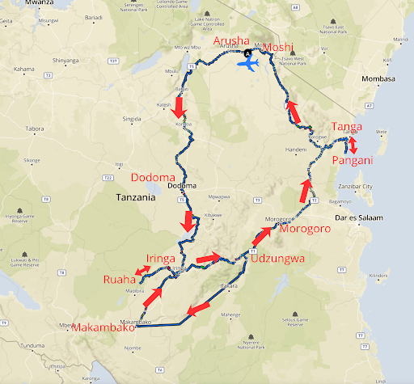
<figcaption>Our 16 day trail</figcaption>
</figure>

</figure>

## Day 1: Kilimanjaro-Arusha-Dodoma
<u>Arrival in Kilimanjaro Airport:</u>
Visa on arrival is 50$. Queue was quite long but took about45 mins to get through (the queues for people who already had a visa took marginally less time but not super different) 

We thought there were bus transfers to Arusha, probably are but didn’t manage to figure that out. Instead we took a private taxi and they began with $50 but then decreased to $35 and told us it was a friend’s price (likely the same spiel for everyone!) 

The taxi driver brought us to Arusha bus station and helped us sort 1) a bus to Dodoma 2) SIM cards 3) some bread for the trip. 

SIM cards: 
SIM cards the easiest is to go to a Vodacom shop in town (there are some on the sides of the bus stations/streets). They take 10.000 Tsh for installing the SIMs and 10.000 for 5GBs of Data). Bring your passport for this.

ATMs: 
We also stopped at an ATM on our way to the station: CRBD was our first stop but they only let you take 400,000 Tsh out at a time. NMB is slightly better: 600,000 Tsh at a time and only 15,000 in fees.

The bus trip Arusha - Dodoma was 7 hours. We left at 14.30 and arrived to Area C Dodoma at 21.30. We slept at Baobab Homestay. Would <u>personally</u> not recommend. The buses also usually stop in the centre of Dodoma and there are (according to our quick google/Booking.com search) fair priced hotels 5-6mjn walk from the station. We personally felt very safe walking at night but easy to take a motorbike/tuktuk to/from anywhere.

## Day 2: Dodoma to Iringa
Next morning we took a motorbike to the station we needed to go to Iringa from. Busbora is the website we were checking for bus timings. It initially said we should leave from Nanenane station which is much further away from Dodoma in the outskirts in thé Dar Es Salaam direction. This is not where we ended up going. We just told the bodaboda driver we were going to Iringa and he took us to a place where buses leave from. We took Rosa Luxury bus to Iringa.

The bus ride from Dodoma to Iringa took about 4 hours. We left at 10.30 and arrived at 14.30. The bus drops you around here: [GPX](https://maps.app.goo.gl/yLFQm2KdkN7LBSiH6){: target="_blank"} point. We walked to the hostel but you can also take bodaboda/tuktuk. 

In Iringa, we stayed at Hidden Valley Backpackers’ Hostel:  

 
It was a great stay with a lovely outdoor area to relax and clean rooms. It’s about 15-20 min walk from town. Our favourite place to eat in Iringa was “Clocktower Cafe”.

<u>Booking the Safari</u> 
We wanted to book a safari in Ruaha National Park but prices online are often inflated, so we walked down to one of the safari shops: [GPX](https://maps.app.goo.gl/V57jf5fXfNTDbaEi8). It cost us $250 for 2 days per person, everything included (and this was a group safari with one other person). We paid in cash in Tsh (there is an NMB ATM nearby).

## Day 3-4: Iringa Safari
They picked us up at 9am the next day. Lunch and dinner included and we stayed in a nice hut even though it was apparently the “cheap option”.

Worth noting that Ruaha was amazing and we saw elephants, lions, giraffes, a leopard, hippos, buffalo, lots of different antelopes… We didn’t see many other cars/tours and this made it feel really special! 

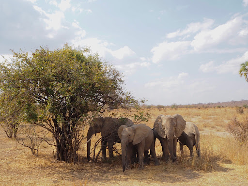{data-gallery="my-gallery"}
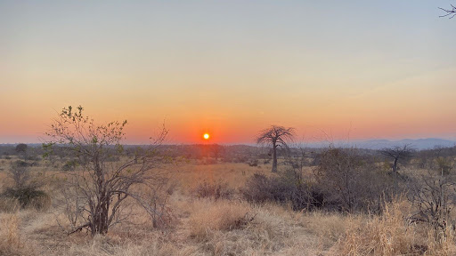{data-gallery="my-gallery"}
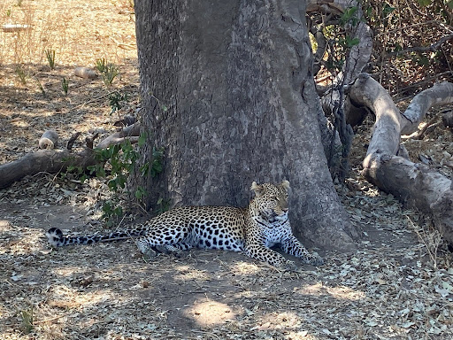{data-gallery="my-gallery"}

## Day 5: Iringa to Mang’ula (Udzungwa National Park) 
We booked a ticket from Iringa to Morogoro the day before leaving (these buses continue on towards Dar so they fill up relatively quickly). We booked at the ABC Upper Class Bus office [GPX](https://maps.app.goo.gl/VEZiZQ4JZCtbFJUD9). We would be stopping in Mikumi but they charge you the same (1 ticket to Morogoro). 

On the bus we just told the attendant that we would be getting off at Mikumi and she kindly looked out for us and told us when we were nearing the stop. Bus left just past 7:30am and arrived at 12 in Mikumi here: [GPX](https://maps.app.goo.gl/D4fuWyj7uCH3UHYi8). We walked away from the bus station to find food but ended up walking a bit far. It’s maybe best to stay around that area for some ugali/chicken because the bus leaving towards Mang’ula leaves from that same location (opposite side of the road though): [GPX](https://maps.app.goo.gl/D4fuWyj7uCH3UHYi8). 

We asked around in Swahili and a woman and 2 guys helped us find the right bus and pay our fare (10k Tsh per person). It was a smaller bus and we ended up sitting at the front with the driver because there were no seats left. It’s just a 1h15 ride. They dropped us off in front of the National Park gate [GPX](https://maps.app.goo.gl/a6YtBRK94KVsNMmaA). 

<figure markdown="span" class="figure-left">
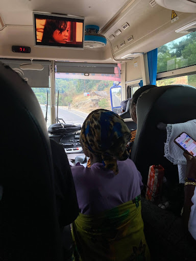
<figcaption>Sometimes seats get filled up and you end up sitting on the floor. Makes for a bumpy but very fun ride. </figcaption>
</figure>

We walked towards Mang’ula B and stayed in Mangabey Lodge the first night. It was 17.000 Tsh for a double room, but the bathroom didn’t smell great and the sheets weren’t very clean, so we changed to Mgaya Executive Lodge for our other two nights (50-70k shillings for foreigners), but this is a great, clean, and well-located option (10 min walk from the National Park gate). We know there are tourist lodges such as Twiga, but they cost 70$ for foreigners for one night and are non-negotiable as they are managed by the government and National Park. 

## Day 6-7-8: Mangula and Udzungwa
### Mangula
Great village to stay at for a couple of days!! You get to experience village life and people are so lovely and happy to help. 
A few tips/places we recommend: 

- Chuda Shop: [GPX](https://maps.app.goo.gl/SWGmKGGs6YQXvdCL8). This little shop has a red cage around it, and is held by Hamida and Chuda. Hamida is absolutely fantastic. She speaks fluent english and helped us with finding fabric (kitenge) and a seamstress (fundi) to make clothes! You can also buy water and snacks from this shop. 
- There was another great shop with pretty decent bread (yellow in colour but very nice!) [GPX](https://maps.app.goo.gl/tFWyGht652HQpE4s7)
For eating, we went to the Mountain Peak Lodge every night we were there. Pretty basic but filling (ugali, chicken, beans) for 10,000 Tsh per person. 
- We also ate at a chips mayai place (chips in egg omelette) on the side of the road (more or less around here: [GPX](https://maps.app.goo.gl/csfxdFQaxDeVZo2W7)).
- You can easily rent bikes around town, we rented on this street: [GPX](https://maps.app.goo.gl/wtxgfJ4CGczXcrmG7). Cost us 600 Tsh for two bikes for an hour. We rode down the road into the rubber plantations [GPX](https://maps.app.goo.gl/8zxbCYCTG5pziC4o7), was a really nice and easy activity. 

Below is the rubber plantation: 

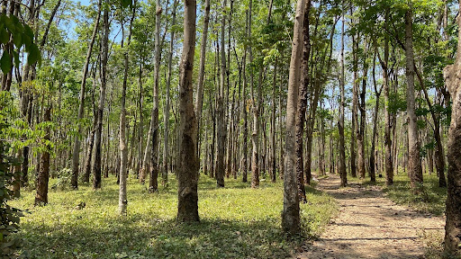
### Udzungwa National Park
There are multiple hikes you can do. There are overnight hikes and day hikes. The ones we did/explored doing were:

- <u>Sanje Waterfall</u> day hike, 4 hours (did)
    - Cost 180,000 Tsh for 2 to pay for park entry, and an extra 50,000 Tsh combined for a guide, You can’t enter the park without a guide. 
    - Was 5 hours but we took our time on the top and swam in the pools of the waterfall. 
    - Nice marked trail, about 6k and 400m elevation.

- <u>Mangabey hike</u> day hike, 6 hours (did) 
    - This hike takes you for around 6 hours, couldn’t really say how much we walked but approximately the same as Sanje. It’s definitely more adventurous though as it takes you off the track and into the forest (wear long pants!) as you look for the Mangabey monkeys. Ours was great fun! The name of our guide below because he was fantastic and knew so much about every specie in the forest. 
    - This is a hike you need to ask about 1-2 days in advance because they send out an expert to track and locate the rare Mangabey monkeys. We asked the afternoon before and was doable.

- Mwanihana hike - 3 days, 2 nights (inquired about but didn’t do) 
    - This trek takes you to Mwanihana summit and back over 3 days. We had inquired about doing it in 2 to reduce cost but found no one willing to do it… I’m sure someone would but we didn’t look very far. 
    - The cost is quite high, you need to pay for park fees for all three days, camping fees (30$ per night), tent rentals (30$ per night), a cook and porters, the guides for all three days and a ranger (you cross buffalo and elephant territory).

- Hidden Valleys day hike, 10 hours (inquired about but didn’t do) 
    - Cost is same as Sanje hike (park fees + guide) but also needed a ranger (60,000 Tsh per day) because you cross elephant and buffalo territory. 
    - We were told elephants are rarely seen and more so during November/December so we decided to go with the Mangabey trail instead. 
    - Trail is about 13km and 1300m elevation, you cross 2 rivers that are ankle deep. 

NB: You cannot enter the park without a guide. 

### Train from Mang’ula to Makambako 
We wanted to take a train in Tanzania. There is the famous Tazara Railway in the South that goes from Dar to Mbeya and beyond to Zambia, but from the info we got, it’s currently not going to Zambia, just stops in Mbeya on the Tanzanian side. 
However it’s possible to hop on/off at different stops on this train. We entertained thé option but the days of the week it passed to/from our preferred stations didn’t stick with our plans. 
The best thing is to contact the station chiefs and booking officers on WhatsApp. Their details are listed on the website: https://www.tazarasite.com/customer-care-reservations-passenger-services 

There is also the Udzungwa Shuttle Passenger Train. This is the one we took from Mang’ula to Makambako. (The starting place is Kidatu, but we got on at Mang’ula). 
We booked on a little late so only second class was available (6 beds to a cabin) instead of 4 beds to a cabin in first class. However, on the day of they proposed we pay for first class (22,800 Tsh per person to go from Mang’ula to Makambako). The cabins are segregated so we stayed in different ones but were next door from each other. 

The train left Mang’ula at 6pm but this timing varies (we were at the station at 4.30pm to avoid missing it). NB: Be careful about timings. At the station at Mang’ula the train board it was Tanzanian timings- which greatly confused us. It’s best to contact the station chief for news on approximate timings closer to your travel date. 

There is a food wagon up the train that serves rice/chips/chicken. 

The ride to Makambako is very bumpy (the train is rickety in itself). We didn’t get much sleep. Vendors are selling water/snacks at every stop from outside the windows.

## Day 9: Leaving Makambako
We arrived at 9am at Makambako's train station.
Makambako was cold (had to put our coats on), and we were a bit tired. So we decided to ditch our plans of going to Matema and Tukayu since the way there was long and we had already seen lots of nature and waterfalls. So instead we took the bus back to Iringa. The train stop right next to the main road, and buses stop along there towards the West towards Mbeya and towards the East towards Iringa. 

We slept one night in Iringa (Hidden Valley Backpackers). Plan was to head to Tanga (northern coast) but to travel there in 2 days instead of 1 to avoid the 13 hour bus trip. 

## Day 10: Iringa to Morogoro
We took ABC Upper Class bus (had booked the night before as they get filled up fast) the next morning all the way to Morogoro (30,000 Tsh per person. left at 7.30, got to Morogoro at 14.30). Upon arrival we booked our ticket for the next day to Tanga. RATCO Express but we booked through an agent called Mbeya City: +255 779701727. It was 35,000 Tsh per person. 

Took a pikipiki to town and stayed at Mama Pierina Hostel (55,000 Tsh for a double room if you pay in person- cheaper than through Booking). The stay was great: rooms are clean and it is held by an italian-greek woman who grew up in Tanzania. There was fresh lasagne for dinner!

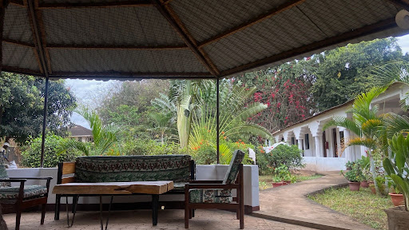

We visited Morogoro on foot, very nice town with beautiful mountains surrounding it. There is a central market where you can buy kitenge (local cloth).

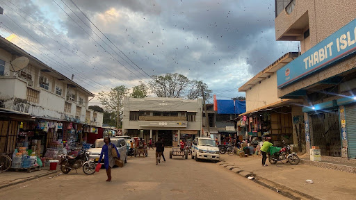  
Also, we’re told there is a train from Dodoma-Dar that stops in Morogoro. It’s modern and takes 1h45 from Morogoro to Dar (not sure of price but could be a good option instead of bus).

## Day 11: Tanga
We took the bus to Tanga. It took about 7 hours, we arrived in the evening. We slept at the Hotel Pope John Paul II: GPX. 40,000 Tsh for double bed with bathroom and breakfast. All very clean and the people were lovely. It’s a 15-20 min walk from centre. 
Had dinner at Arbab Tanga SeaFood: GPX. Good option late in the evening when there is nothing open/no fish left anywhere to eat. 

## Day 12-13: Pangani - North-Eastern Coast

From Tanga towards Pangani there are hourly departures of daladalas from the Pangani bus station - any tuktuk/bodaboda driver will know this place and take you there. The trip costs 5000 Tsh per person to Pangani / any point along that road up until Pangani. We got there about 9:15 and had to wait until 10 (more or less, they wanted to wait until the bus filled up to leave). The drive is about 2 hours to Pangani. 

We wanted a coastal stay so we chose: Juani Pangani - [GPX](https://maps.app.goo.gl/sAYsvj4SJArfRTtm9). We just told the daladala driver where we wanted to get off and they dropped us off on the road- after that, we walked 10 mins to the place. It felt very peaceful and was an incredible value for money (70000 Tsh per night). We had the place to ourselves: 2 single beds and a huge living area with a kitchen (if you bring your own food you can cook), and a seated area that is covered but outdoors and next to the palm trees.

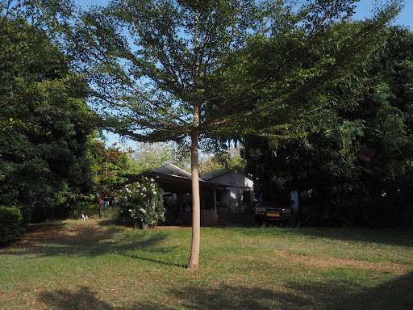{data-gallery="my-gallery"}
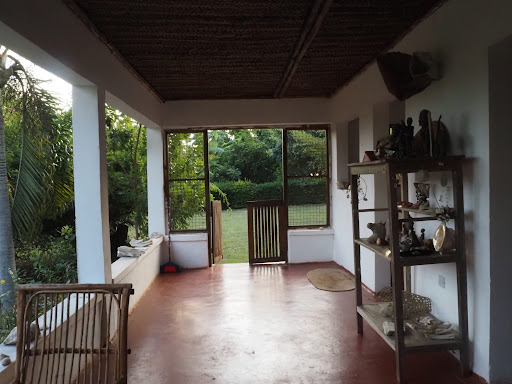{data-gallery="my-gallery"}

Benny (the caretaker - +255678312518) was a great help- he brought us to Pangani for our day trip and came to pick us up again. He also organised the day trip through a contact: Kassim (+255 717463871).  

The day trip we chose was Maziwe Island. It’s a sandbank about 35 minutes away from Pangani by boat. It cost us 60 USD each and included the boat trip, entry to the nations park, the guides, and a snorkelling mask. We arrived first to the island and it was truly magical. A few more groups arrived later. The snorkelling was great- coral, fish.

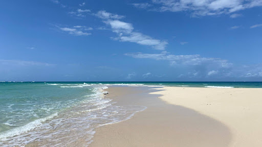

## Day 14: Pangani to Moshi
To leave Juani Pangani, we just set up by the main road and waited for the first daladala passing by. We got picked up after 10 mins and it took us another 1h30 to get back to Tanga (Pangani bus station). 

From there we took a Tuktuk to the station where buses leave for Moshi. The first one was leaving 5 minutes after we arrived. 

However: word of caution- the guys at the bus stations will try shepherding you onto a bus as quickly as possible to avoid losing our business to other companies. Our mistake was being easily led onto the first bus leaving which turned out to be the most inefficient bus of them all. It took us 9 hours approximately when it should have been a 7 hour bus ride. The bus in question stopped at each small village, picking up and dropping people along the way. Advice: look into the good bus companies/ask around before getting to the bus station so you have an idea of which one is the express bus. We paid 30,000 Tsh each from Tanga to Moshi. 
## Day 15: Moshi
Not particularly impressed by this city. We stayed at Climbers’ Home the first night which was basic but fine. We moved to Mahali House [GPX](https://maps.app.goo.gl/5ciuubnG7NC57NXG8) which was great and a 30 min walk or 8 min pikipiki from town. 

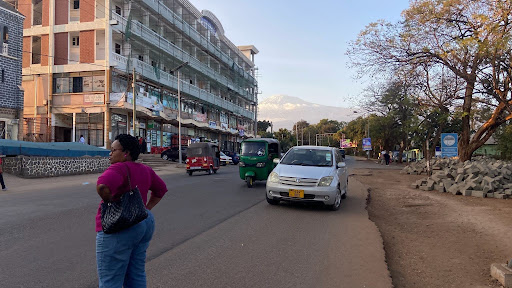

We had dinner (both great) at:  

- Paji’s Bar and Restaurant [GPX](https://maps.app.goo.gl/Zx4D2XpSQGwsb3rAA) 
    - Indian food but on the more expensive side of things if you’re on a budget - we paid 60k Tsh for two curries, two naans, rice portion and 2 waters. 
- Moshi Pazuri Bar & Restaurant [GPX](https://maps.app.goo.gl/7BphrtQLUSbmGfrV7)    
    - Grilled meat and sides, very good and nice vibes in the evening (music, pool tables etc) 

## Day 16: Leaving Tanzania
If you’re in Moshi or Arusha, the day before departure you can go to the Air Tanzania office and they had a shuttle leaving the next morning at 4:30 from in front of their office tower. It was on time and cost 15,000 Tsh per person. It seems most private shuttles quote around 50USD. 

## Tips and other info
- Prices are generally all flexible, just barter (not National Park entry/guide prices).
- WhatsApp is king: ask for people’s numbers and communicate through there
- Buses: Buses in Tanzania leave relatively on time usually. The buses we have had varied in quality but most have plugs for charging, some have aircon. The nicest we took was ABC company from Iringa to Mikumi. ABC and RATCO were the only ones that had toilets. Some of the buses we took did not stop for toilet breaks. The tickets cost us anywhere between 20.000 and 40.000 for 4-8 hour journeys respectively. We didn’t pay more than that. But bear in mind different operators will have different prices. Busbora can help you find a good idea for how much it will cost you to get from place to place. If you’re unsure where to head, just ask around and people will help you get to the right place/station for the bus/direction you need. Sometimes it’s just a spot on a sidewalk. Men are usually nearby trying to sell bus seats, and they’ll come towards you to ask where you’re going. We went with the flow and got on all the right buses. They can’t really overcharge you because bus fares are standardised per company. 
- Most dishes (eg. Ugali) we ate with our hands. You can ask for cutlery but depends on the place and how "local" you go! 
- "Time/Hours" are different in Tanzania: to get the local time you need to take away 6. e.g. 10 in the morning (International time) is 4 in the morning in Tanzania. Do not worry if you see very different times on bus/train boards. Always double check: https://www.langmedia.fivecolleges.edu/resources/tanzania/basic-communications/telling-time 
- Learn numbers in swahili- very helpful for knowing the price of things and bartering. Some slang words are used for standard amounts.

- Important words used:
    - Daladala: local bus that doesn’t cover very long distances (normally not the same as "basi" which is the longer buses). 
    - Bodaboda/Pikipiki: Motorbike. We use these interchangeably but it seems pikipiki is more often used in Tanzania. Bodaboda is understood by everyone though.

## More photos!

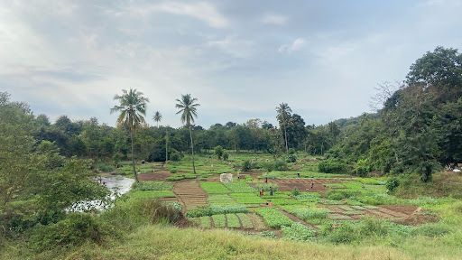{data-gallery="my-gallery"}
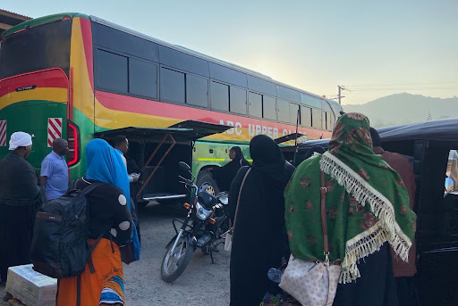{data-gallery="my-gallery"}
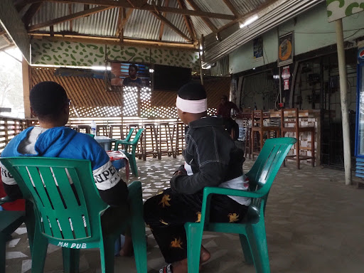{data-gallery="my-gallery"}
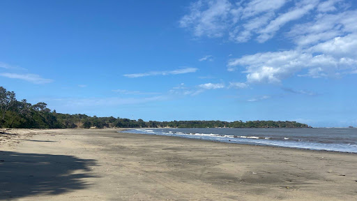{data-gallery="my-gallery"}

